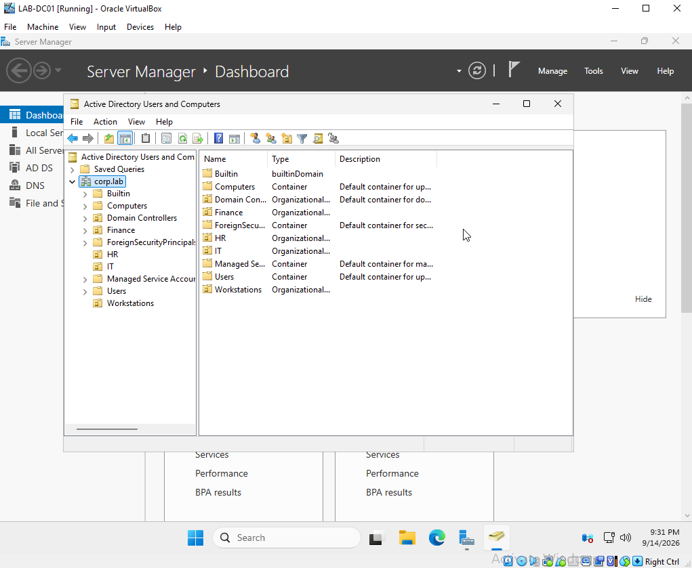
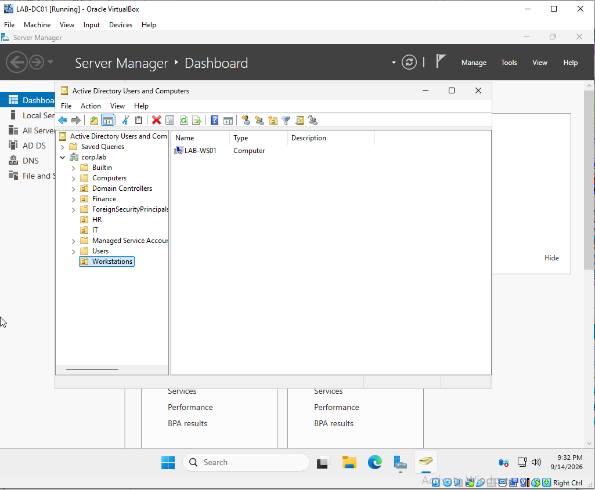
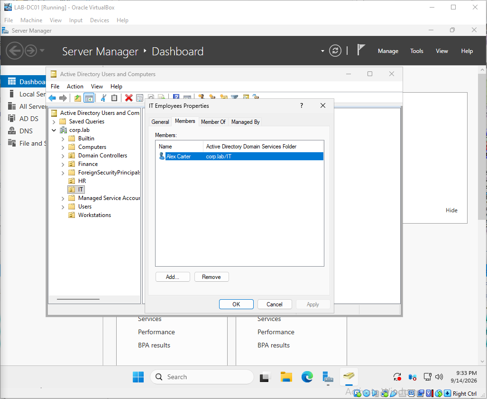
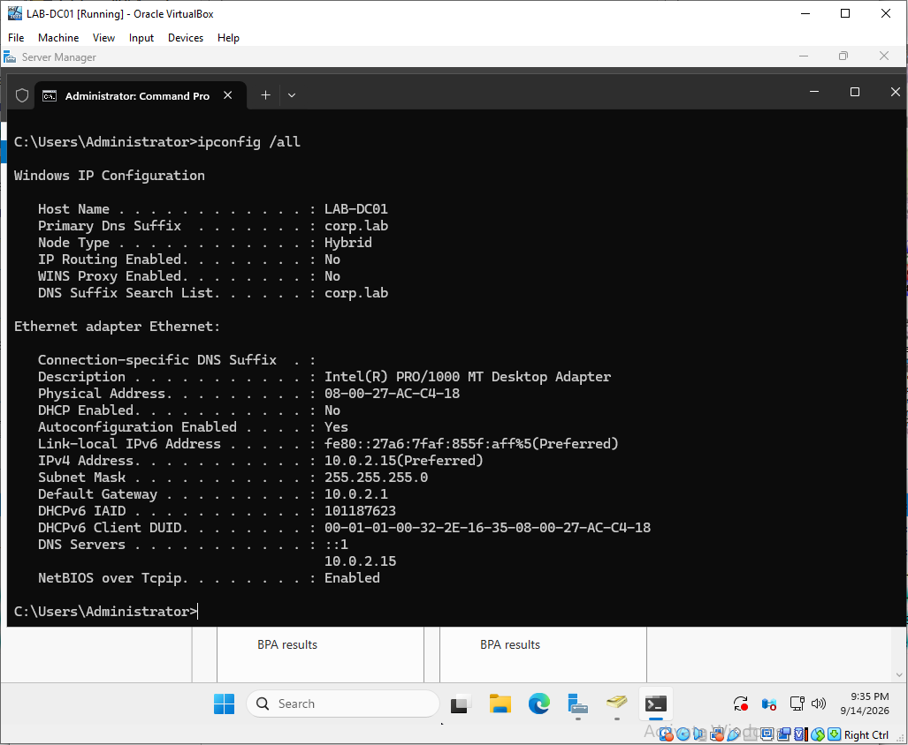
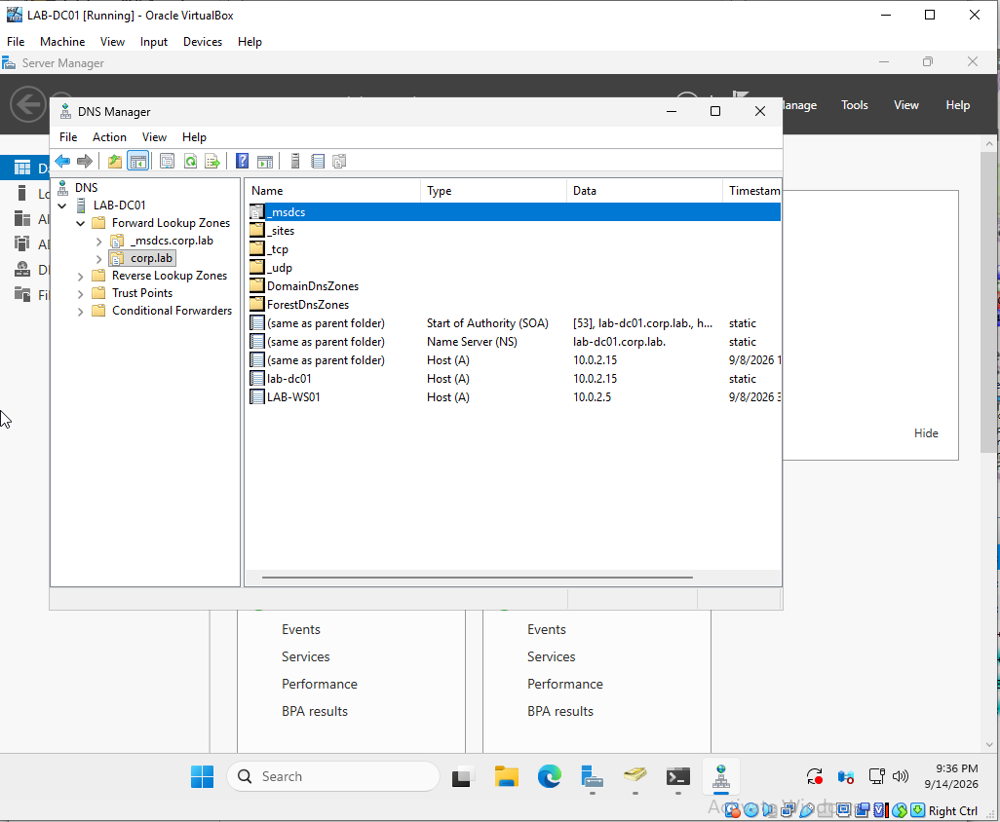
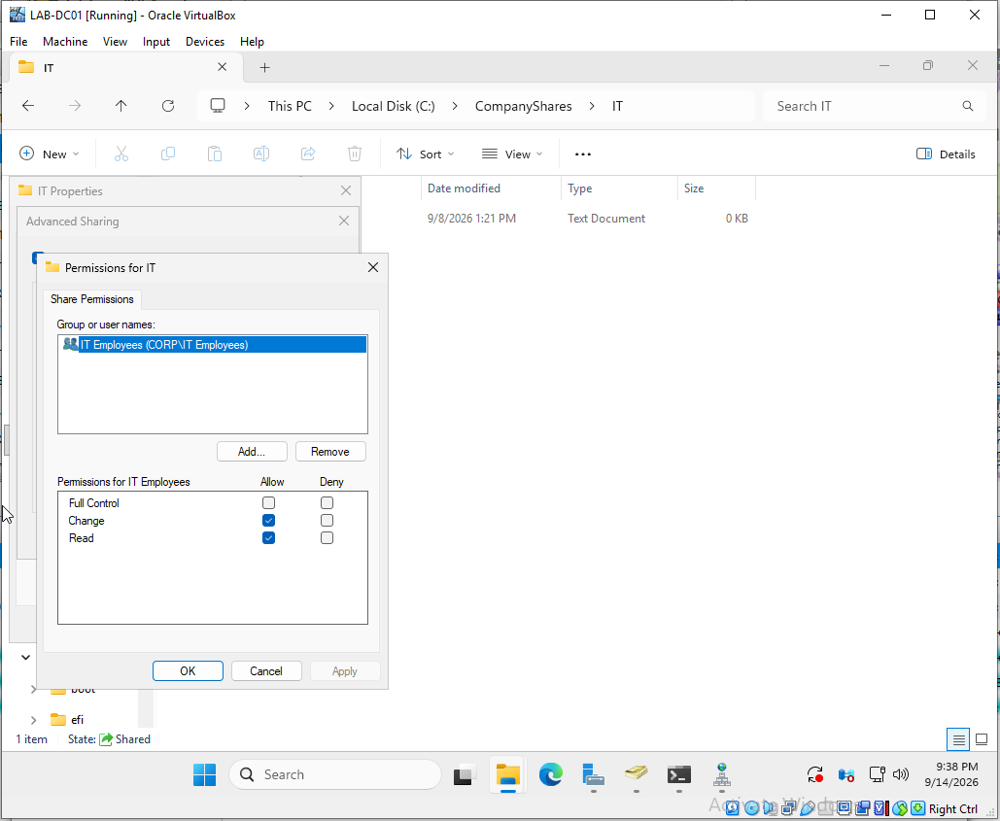
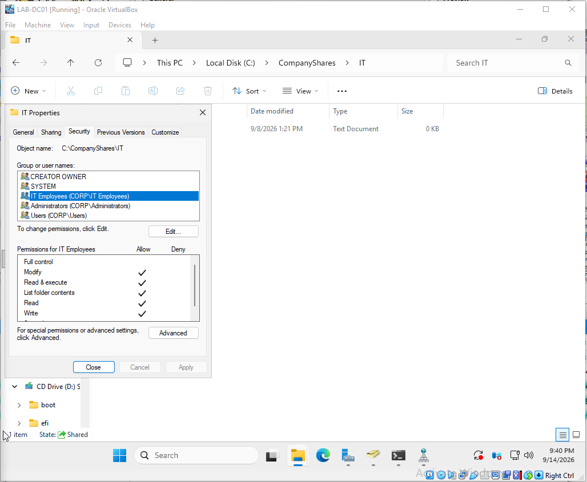
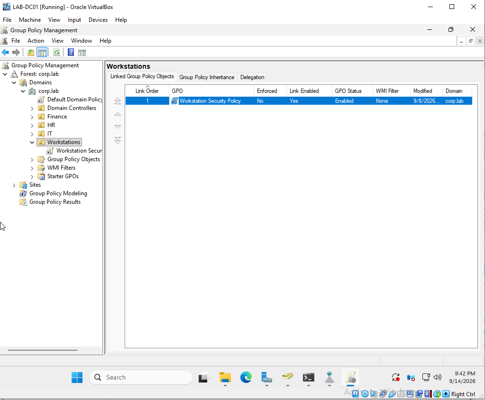
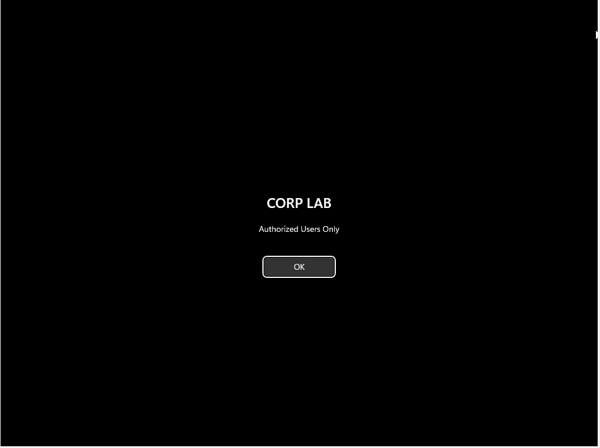
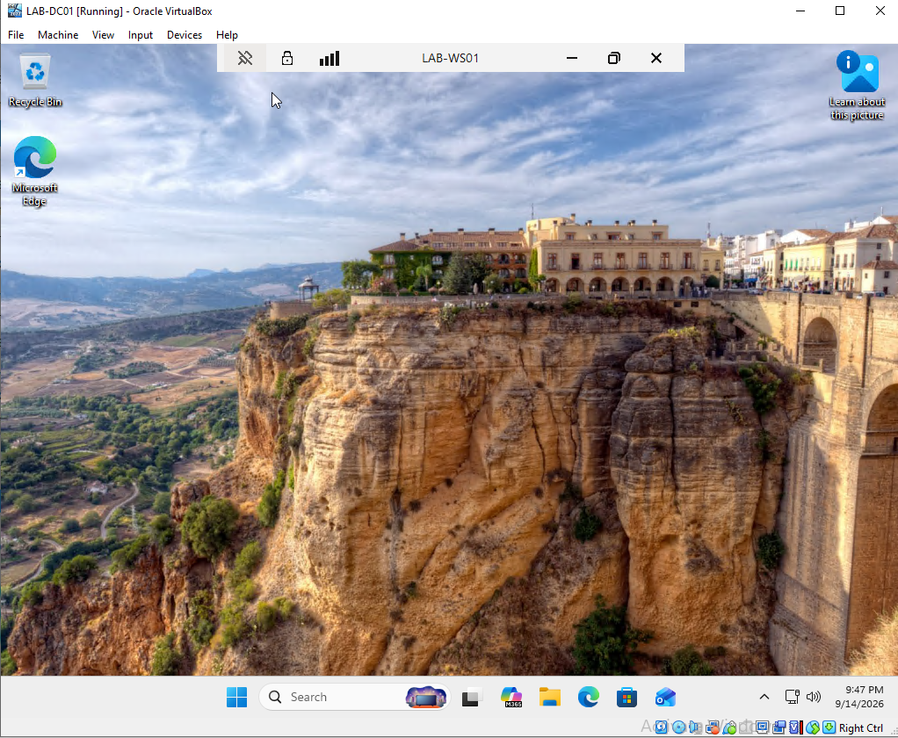

# Enterprise IT Support Lab

## Overview

I built this home lab to gain hands-on experience with Windows enterprise administration and IT support. The environment uses Windows Server 2025 and Windows 11 Pro in VirtualBox to simulate a small corporate Active Directory domain.

The lab includes Active Directory Domain Services, DNS, Group Policy, user and group administration, file sharing and permissions, Remote Desktop support, and structured troubleshooting scenarios.

## Lab Environment

- **Domain:** corp.lab
- **Domain Controller:** LAB-DC01
- **Client Workstation:** LAB-WS01
- **Server OS:** Windows Server 2025
- **Client OS:** Windows 11 Pro
- **Virtualization:** Oracle VirtualBox
- **Domain Controller IP:** 10.0.2.15
- **Active Directory:** AD DS
- **DNS:** Windows DNS Server

## What I Configured

### Active Directory
- Created the `corp.lab` Active Directory domain.
- Created organizational units for IT, HR, Finance, and Workstations.
- Created domain users and security groups.
- Added Alex Carter to the `IT Employees` security group.
- Joined `LAB-WS01` to the domain and placed it in the Workstations OU.

### File Sharing and Permissions
- Created the `C:\CompanyShares\IT` shared folder.
- Configured share permissions for `IT Employees` with Change and Read access.
- Configured NTFS permissions with Modify access.
- Verified that group membership controlled access to the shared folder.

### Group Policy
- Created and linked a `Workstation Security Policy` GPO to the Workstations OU.
- Configured a login banner displaying `CORP LAB` and `Authorized Users Only`.
- Configured a 5-minute machine inactivity lock policy.
- Applied policies using `gpupdate /force`.

### Remote Support
- Enabled Remote Desktop on `LAB-WS01`.
- Verified Remote Desktop Services and firewall settings.
- Connected remotely from `LAB-DC01` to `LAB-WS01`.

## Troubleshooting Scenarios

### 1. Account Lockout
- Configured a domain account lockout policy with a threshold of three failed logon attempts.
- Reproduced an account lockout using the Alex Carter domain account.
- Diagnosed the issue from the Windows sign-in error.
- Unlocked the account through Active Directory Users and Computers without unnecessarily resetting the password.
- Verified successful sign-in after the account was unlocked.

### 2. DNS Resolution Failure
- Changed the workstation DNS server from the domain controller to `8.8.8.8`.
- Verified that internet connectivity and public DNS resolution still worked while `corp.lab` and `LAB-DC01.corp.lab` failed to resolve.
- Confirmed Group Policy processing also failed because the workstation could not resolve the domain.
- Restored DNS to `10.0.2.15`, flushed the DNS cache, and verified domain name resolution and Group Policy functionality.

### 3. Default Gateway Failure
- Removed the workstation's default gateway to simulate loss of external network access.
- Verified that the workstation could still reach the domain controller and resolve internal DNS records.
- Identified the missing default gateway as the reason internet traffic failed.
- Restored the gateway to `10.0.2.1` and verified internet connectivity.

### 4. Shared Folder Permission Failure
- Reduced the `IT Employees` share permission to Read while leaving NTFS Modify permissions in place.
- Verified that the user could open the share but could not create or modify files.
- Identified the more restrictive share permission as the cause.
- Restored Change and Read permissions and verified file creation and deletion.

### 5. Print Spooler Failure
- Stopped the Windows Print Spooler service to simulate a printing issue.
- Reproduced the printer error from the user workstation.
- Identified the stopped Print Spooler service as the cause.
- Restarted the service and verified the Windows print interface was functional again.

### 6. Remote Desktop Failure
- Stopped Remote Desktop Services on `LAB-WS01` to simulate a remote support failure.
- Reproduced the failed RDP connection from `LAB-DC01`.
- Identified the stopped service as the cause.
- Restarted Remote Desktop Services and verified a successful RDP connection.

  ## Screenshots

### Active Directory Structure

### Domain Workstation

### Security Group Membership

### Domain Controller Network Configuration

### DNS Configuration

### Share Permissions

### NTFS Permissions

### Group Policy

### Group Policy Login Banner

### Remote Desktop Support

## Skills Demonstrated

- Active Directory Domain Services administration
- Windows Server and Windows 11 support
- User, group, and computer account management
- Organizational Unit administration
- Group Policy configuration and deployment
- DNS configuration and troubleshooting
- IPv4 addressing, subnetting, and default gateway troubleshooting
- SMB file sharing
- Share and NTFS permissions
- Remote Desktop support
- Windows service troubleshooting
- Account lockout troubleshooting
- Structured incident diagnosis and verification
